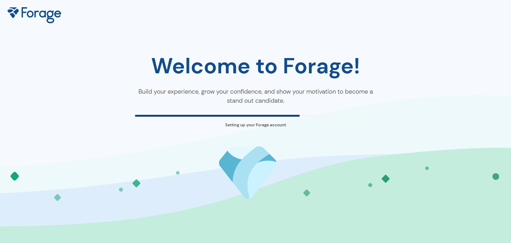
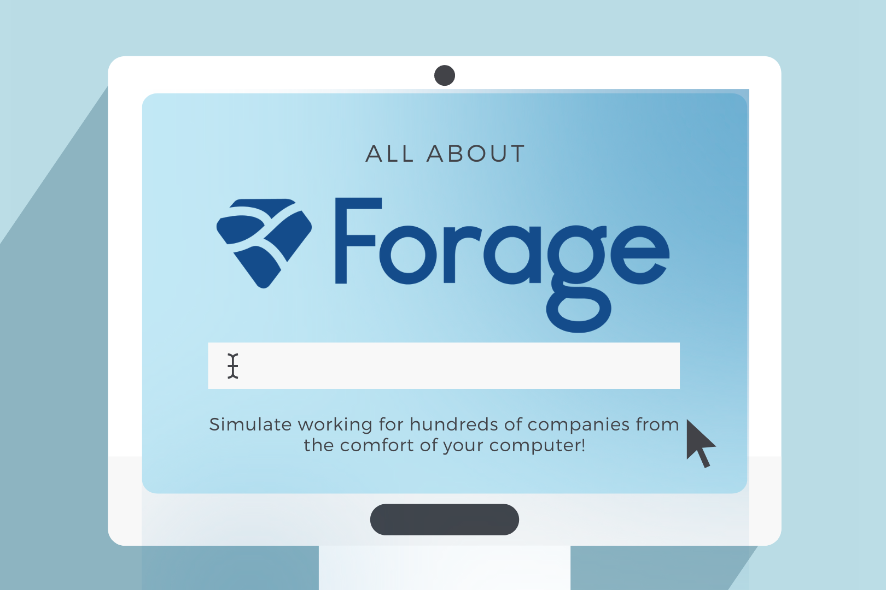
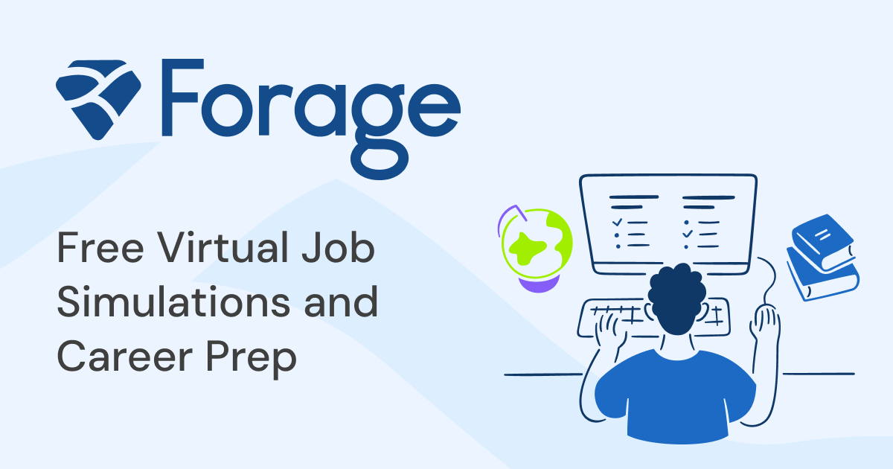

# 🚀 Forage Job Simulation Programs – Practical Learning for Beginners & Freshers

`Free-virtual-job-simulations-and-career-prep-Forage`

For students, beginners, and freshers seeking **practical exposure before entering the job market**, **Forage Job Simulation Programs** offer an excellent and industry-relevant learning experience.

Designed in collaboration with **leading global companies**, Forage provides learners with a **realistic understanding of professional roles** through structured, hands-on tasks.

These simulations help learners experience **real workplace scenarios** before stepping into a professional role.

---

# 🌍 About Forage

**Forage** is on a mission to help motivated students **gain real-world skills and land great jobs**.

The platform connects learners with **industry-designed job simulations**, allowing them to experience the **day-to-day work of professionals across multiple industries**.

---

## 🎯 Mission

> We want to build a world where candidates are considered **equally on their merits**.

Your **skills, grit, and drive** should be recognized and rewarded — regardless of background.

---

# 📊 Platform Impact

- 📈 **3.3× more likely** to land a job after completing a job simulation
- 🏢 **300+ job simulations**
- 🤝 **125+ global employers**
- 👨‍🎓 **5M+ students registered worldwide**

---

# 💡 Why Forage Job Simulations Are Valuable

* ✅ **100% Free Learning** – No financial barriers  
* ✅ **Real-World Tasks** – Work on industry-based assignments  
* ✅ **Self-Paced Programs** – Learn anytime at your own speed  
* ✅ **Career Exploration** – Understand different job roles  
* ✅ **Portfolio Building** – Earn certificates to showcase your skills  

---

# 🧠 How Forage Job Simulations Work

### 1️⃣ Register on Forage

Create your account and share some information about yourself.

### 2️⃣ Enroll in a Job Simulation

Choose a program based on your **career interest or learning goal**.

### 3️⃣ Complete Real-World Tasks

Work on assignments that simulate **actual company work scenarios**.

### 4️⃣ Compare with Model Solutions

Evaluate your approach using **expert-provided model answers**.

### 5️⃣ Earn a Certificate

Showcase your achievement on **LinkedIn, GitHub, or your portfolio**.

---

# 📚 Forage Learning Resources

Forage provides a wide range of **job simulations and career-focused learning resources** across multiple professional domains.

These resources allow learners to **explore different industries, understand real job roles, and gain hands-on experience through practical simulations** designed by leading global companies.

Through these learning paths, students and beginners can **develop industry-relevant skills, build confidence, and prepare for real-world professional environments**.

- 📊 **Data Analytics & Data Science**
- 🛠 **Data Engineering**
- 🔐 **Cyber Security & Security**
- 💻 **Software Engineering**
- 💼 **Consulting & Management**
- 🏦 **Banking & Financial Services**
- 💰 **Finance, Investment & Tax**
- ⚖ **Law, Legal & Real Estate**
- 📢 **Marketing & Operations**
- ⚙ **Engineering**
- 📈 **Business & Strategy**

## 📚 Additional Learning Resources

- 🎓 **For Students**
- 📘 **Short Courses**
- 💼 **All Job Simulations**
- 📝 **Student Blog**

---

# 📚 Job Simulation Resources for Beginners

Below is a **structured list of job simulations** to help beginners easily explore programs.

You can keep adding new simulations here as you complete them.

---

## 🧠 Job Simulation Programs

| No | Job Simulation | Company | Link |
|----|---------------|--------|------|
| ✅ 1 | Data Analytics Job Simulation | Accenture | [View Program](https://www.theforage.com/simulations/accenture/data-analytics) |
| ✅ 2 | Software Engineering Job Simulation | JPMorgan Chase | [View Program](https://www.theforage.com/simulations/jpmorgan/software-engineering) |
| ✅ 3 | Consulting Job Simulation | Boston Consulting Group | [View Program](https://www.theforage.com/simulations/bcg/consulting) |
| ✅ 4 | Cyber Security Job Simulation | Mastercard | [View Program](https://www.theforage.com/simulations/mastercard/cybersecurity) |
| ✅ 5 | Data Science Job Simulation | Deloitte | [View Program](https://www.theforage.com/simulations/deloitte/data-analytics) |

---

# 🏆 Skills You Will Develop

Through job simulations, learners strengthen:

- 📌 **Logical and analytical thinking**
- 📌 **Business problem-solving abilities**
- 📌 **Industry-relevant technical skills**
- 📌 **Professional confidence**
- 📌 **Decision-making capability**

---

# 💼 Adding Forage to LinkedIn

Forage job simulations can be added to the **LinkedIn Experience Section** as a **Virtual Internship**.

### Include:

`Job Simulation Title`
`Company Name`
`Tasks Completed`
`Certificate`

---

### This helps showcase:

- ✔ **Real-world work experience**
- ✔ **Practical problem solving**
- ✔ **Job-ready skills**

> Recruiters often value **hands-on experience over theory alone**.

---

# 📜 Certification Benefits

After completing a simulation, learners receive:

- 📄 **Verified Certificate**
- 📊 **Task-based learning outcomes**
- 🔗 **Sharable program link**

You can showcase these on:

- `LinkedIn`
- `GitHub`
- `Portfolio Websites`
- `Resume`

---

# 🌉 Forage – Bridging Education & Industry

Forage acts as a **bridge between education and career success**.

It allows learners to:

- ✔ **Explore career paths**
- ✔ **Develop job-ready skills**
- ✔ **Experience real work scenarios**
- ✔ **Build confidence before entering the workforce**

Highly recommended for **students, beginners, and freshers preparing for professional careers**.

---

# 🔗 Explore Forage

### 🌐 Website: https://www.theforage.com 

[Start Simulation](https://www.theforage.com)

- `Short Courses`
- `Job Simulations`
- `Student Blog`
- `Resources`

---

# 🏁 Final Thoughts

If you are serious about **career development, skill building, and professional growth**, **Forage job simulations** provide an excellent opportunity to **learn by doing**.

Start exploring simulations and **build real-world skills today**.

---

